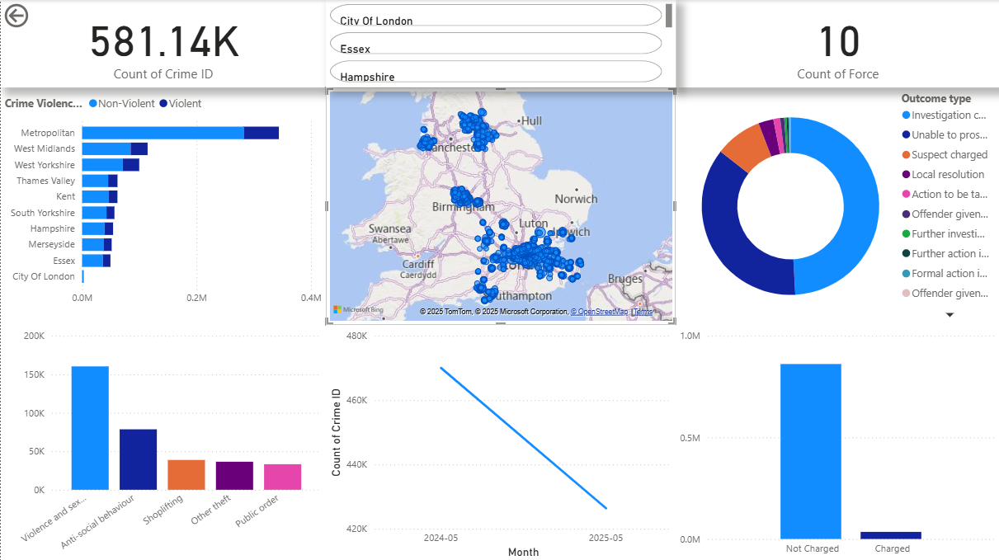
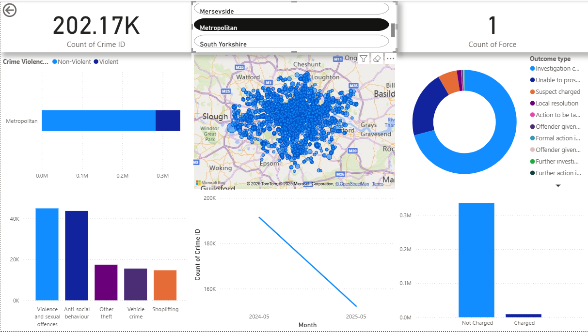

# Power-BI-analysis-of-UK-crime-data-for-May-2024-May-2025

# 📊 Power BI Project: UK Crime Analysis

This project analyzes UK street-level crime data for **May 2024** and **May 2025**, focusing on the top 10 police forces by population. The dashboard was built in **Power BI Desktop** using **Power Query (M)** for data transformation and **DAX** for custom metrics.

---




---
## 🔍 Objectives

- Load only relevant monthly data from the Police API export folders
- Combine "street" and "outcomes" CSVs into one clean dataset
- Analyze trends in violent vs non-violent crime
- Assess outcome types by police force
- Build a clean, interactive dashboard with slicers and drill-downs

---

## 📁 Data Pipeline (Power Query M Code)

Only specific files are imported — filtered by folder name (month), file name pattern (force and type), and existence. This improves loading speed and avoids unnecessary data bloat.

```powerquery
let
    BasePath = "C:\\Users\\Snatch\\Desktop\\power_bi_project\\raw_data\\police",
    Months = {"2024-05", "2025-05"},
    Top10Forces = {"metropolitan", "west-midlands", "city-of-london", "west-yorkshire", 
                   "thames-valley", "merseyside", "south-yorkshire", "hampshire", "essex", "kent"},
    Types = {"street", "outcomes"},

    ExpectedFilesList = List.Transform(Months, each
        let month = _
        in List.Transform(Top10Forces, each
            let force = _
            in List.Transform(Types, each
                [
                    FolderMonth = month,
                    Force = Text.Proper(Text.Replace(force, "-", " ")),
                    SourceType = if _ = "street" then "Crime" else "Outcome",
                    FileName = month & "-" & force & "-" & _ & ".csv",
                    FilePath = BasePath & "\\" & month & "\\" & month & "-" & force & "-" & _ & ".csv"
                ]
            )
        )
    ),

    FlatList = List.Combine(List.Transform(ExpectedFilesList, each List.Combine(_))),
    ExpectedFiles = Table.FromRecords(FlatList),

    AddContent = Table.AddColumn(ExpectedFiles, "Content", each try File.Contents([FilePath]) otherwise null, type binary),
    ExistingFiles = Table.SelectRows(AddContent, each [Content] <> null),

    Import = Table.AddColumn(ExistingFiles, "Data", each
        let
            raw = Csv.Document([Content], [Delimiter = ",", Encoding = 65001, QuoteStyle = QuoteStyle.Csv]),
            promoted = Table.PromoteHeaders(raw, [PromoteAllScalars = true])
        in
            promoted,
        type table
    ),

    Expanded = Table.ExpandTableColumn(Import, "Data",
        {"Crime ID", "Month", "Reported by", "Falls within", "Longitude", "Latitude", "Location", 
         "LSOA code", "LSOA name", "Crime type", "Outcome type", "Last outcome category", "Context"},
        {"Crime ID", "Month", "Reported by", "Falls within", "Longitude", "Latitude", "Location", 
         "LSOA code", "LSOA name", "Crime type", "Outcome type", "Last outcome category", "Context"}
    ),

    RemoveColumns = Table.RemoveColumns(Expanded, {"Content", "FilePath"}),
    Final = Table.RenameColumns(RemoveColumns, {"FileName", "Source File"})
in
    Final
```

🧮 DAX Measures & Columns
1. Total Crimes
```
Total Crimes = COUNTROWS('Final')
```
2. Charged vs Not Charged (Based on Outcome)
```
ChargedFlag = 
IF (
    'Final'[Outcome type] IN {
        "Suspect charged",
        "Suspect charged as part of another case"
    },
    "Charged",
    "Not Charged"
)
```
3. Crime Violence Category (Simplified Classification)
```
Crime Violence Category = 
SWITCH(
    TRUE(),
    'Final'[Crime type] IN {"Possession of weapons", "Robbery", "Violence and sexual offences", "Public order"}, "Violent",
    "Non-Violent"
)
```
📊 Visualizations-
    Bar Chart: Crime Type by Police Force
    Bar Chart: Charged vs Not Charged by Force
    Pie Chart: Crime Categories (Violent / Non-Violent)
    Map: Crime Locations (Latitude/Longitude)
    Line Chart: Month-on-Month Crime Volume
    Slicers: Filter by Force, Month, Crime Type, Outcome Type
    Drilldown: Top 5 Crime Types per Force

🧠 Skills Demonstrated-
    Power Query optimization
    DAX for logic and classification
    Custom visual hierarchies and drilldowns
    Data cleaning across multiple file structures
    Geographic mapping and category tagging
    Dashboard design for storytelling

🚀 How to Use-
    Clone or download this repo
    Open the .pbix file in Power BI Desktop
    Make sure your data folder structure matches or edit the path in Power Query
    Interact with slicers, visuals, and map

🧾 Notes-
    Only two months of data are loaded for performance
    Based on data.police.uk
    No personal data included
    Fully offline-capable

📌 To-Do (Future Work)-
    YOY comparison measures
    Tooltip customization
    Publish to Power BI Service (with organizational email)
